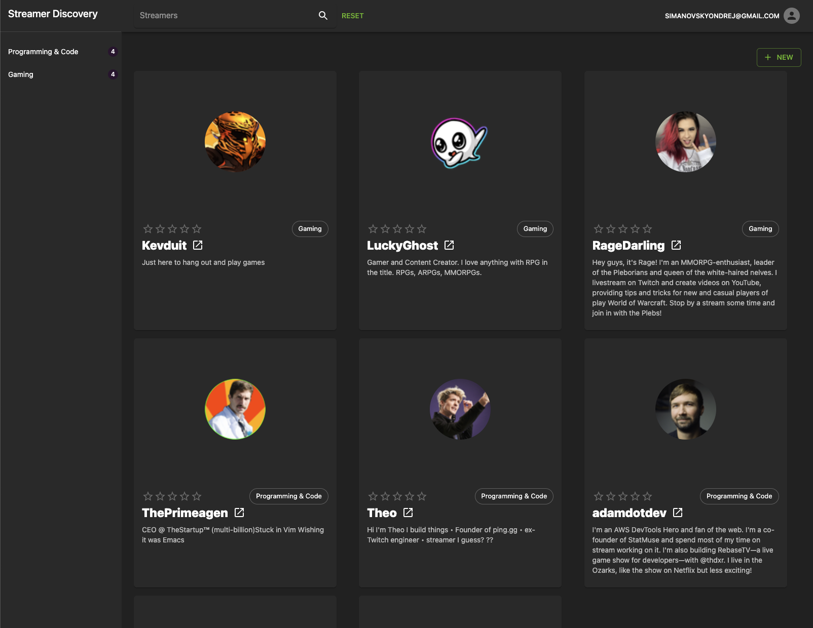

## Stream discovery

### Cover Image

[]()

### Project Demo link

- [Demo](https://stream-discovery.vercel.app/streamers)
  (https://stream-discovery.vercel.app/streamers)

## About

### Description

Streamer discovery is web app to discover, create and rate twitch streamer. Guest users can only search streamer.
Logged in users can create new streamer and rate existing one.

### Backend

- CRUD (Query + Mutation Operations)
- Authorization / Postgres Row Level Security
- Supabase - Backend with a Postgres Database, Authentication

### Frontend

- [Refine](https://refine.dev/)
- [Next.js with typescript](https://nextjs.org/)
- [Material UI](https://mui.com/)

### Preview

To provide a comprehensive understanding of the submission, add visuals such as GIFs, images and videos have been incorporated to give an impression of what it looks like.

### Install Project

- Clone the repository:

```
git clone https://github.com/JustOndra/stream-discovery.git
```

- Change directory and install dependencies:

```
cd stream-discovery
npm install
```

- Setup env

```
cp streamer-discovery/.env.example streamer-discovery/.env
```

- Run app

```
npm run dev
```
